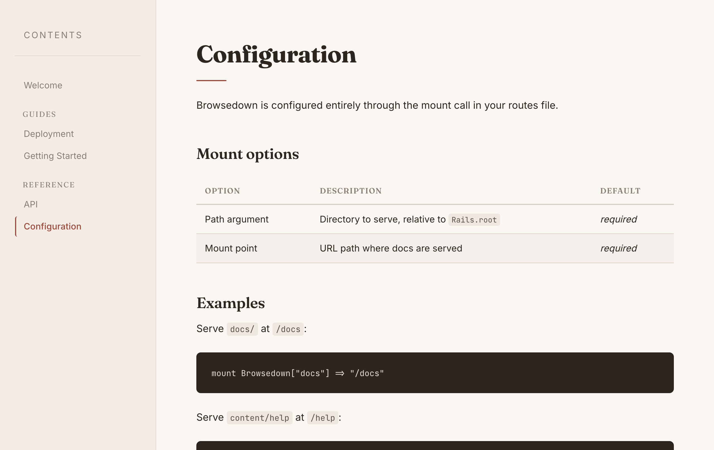
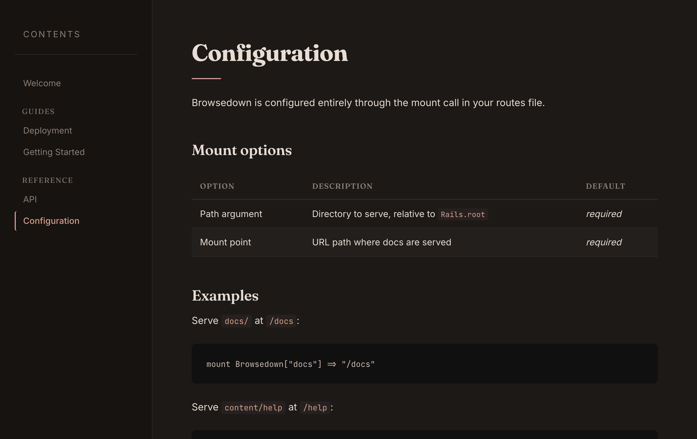

# Browsedown

A Rails engine that serves a directory of markdown files as a browsable documentation site.

Point it at a folder, mount it in your routes, and your `.md` files become readable in the browser.





## Installation

Add to your Gemfile:

```ruby
gem "browsedown"
```

## Usage

Mount it in `config/routes.rb`:

```ruby
mount Browsedown["docs"] => "/documentation"
```

This serves all `.md` files under `Rails.root/docs` at `/documentation`.

The path argument is relative to `Rails.root`:

```ruby
Browsedown["content/guides"]  # => Rails.root/content/guides
```

## How it works

- Scans the directory tree for `*.md` files
- Renders markdown to HTML using Redcarpet (fenced code blocks, tables, autolinks, strikethrough)
- Groups pages by directory in the sidebar
- Shows `README.md` as the landing page if one exists
- Requests outside the configured root return 404
- Dark and light mode via `prefers-color-scheme`

## Requirements

- Ruby >= 3.0
- Rails >= 6.0

## License

MIT
